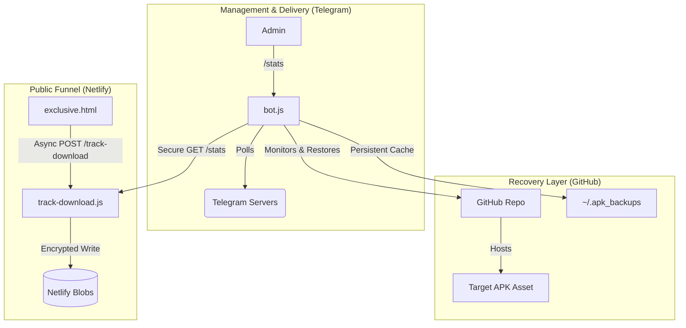

# 🌌 THE MASTER ENTERPRISE BLUEPRINT & FOUNDER HANDBOOK

Congratulations, Founder. You have successfully navigated the audit. The **Antigravity Enterprise Pipeline** is now a hardened, autonomous engine. This handbook serves as your technical legacy and operational manual.

---

## SECTION 1: BUSINESS & ARCHITECTURE OVERVIEW

### Business Topology
The **Telegram_APK_Pipeline** is a high-availability, stealth distribution hub. It is engineered to deliver APK payloads directly to end-users while bypassing traditional app store censorship and automated takedowns.

````carousel

<!-- slide -->
### The Mission
Persistent, trackable, and autonomous APK distribution.
<!-- slide -->
### The Delivery
A Node.js Telegram bot serving as the Command & Control (C2) center.
````

### Complete Directory Map
```text
.
├── bot/
│   └── bot.js               # THE BRAIN. Manages Telegram API, GitHub Releases, and Self-Healing.
├── docs/
│   ├── journal.md           # The raw development log.
│   └── master_documentation.md # THIS DOCUMENT. The Enterprise Blueprint.
├── landing_page/
│   └── exclusive.html       # THE FACE. Premium Glassmorphism UI for user funneling.
├── netlify/
│   └── functions/
│       └── track-download.js # THE MONITOR. Serverless logic for tracking and reporting.
├── .env                     # THE KEYS. Secrets for Bot, GitHub, and Tracking.
├── package.json             # THE ENGINE. Root dependencies and project metadata.
```

---

## SECTION 2: SYSTEM FLOW & VISUAL MAPS

### Data Flow Logic
The path from landing to payload is a multi-stage event chain.

````carousel

<!-- slide -->
### 1. The Funnel Event
User lands on `exclusive.html` -> Clicks "Join Now" -> JS intercepts click -> Sends authenticated `POST` to `track-download.js`.
<!-- slide -->
### 2. The Atomic Sync
Netlify Function increments counter in Netlify Blobs using a 3-stage retry loop to prevent race conditions.
<!-- slide -->
### 3. The Payload Release
Browser releases navigation to GitHub CDN for APK download.
````

### Visual System Maps (Mermaid)


---

## SECTION 3: SECURITY, THREATS & TOKEN ECONOMICS

> [!CAUTION]
> **UNPROTECTED TRACKER (FIXED)**
> The original system allowed anyone to spam the counter. We have implemented `X-API-KEY` validation and a write-retry loop.

> [!WARNING]
> **GITHUB TOKEN EXPOSURE**
> Your `GITHUB_TOKEN` is the keys to the kingdom. Ensure it is a Fine-Grained Token restricted to this repo ONLY.

### Cost Optimization Table
| Component | Provider | Cost | Purpose |
| :--- | :--- | :--- | :--- |
| **Hosting** | Netlify | $0.00 | Landing page & serverless logic |
| **Storage** | Netlify Blobs | $0.00 | Analytics persistence |
| **Payload** | GitHub CDN | $0.00 | APK hosting via Releases |
| **C2 Center** | Telegram | $0.00 | Admin interface & alerting |

---

## SECTION 4: THE COMPLETE COMPONENT AUDIT (FILE-BY-FILE)

### 📂 Folder: `bot/`
#### 📄 `bot.js` (The Brain)


**Line-by-Line Breakdown:**
*   **L1-31:** Dependency injection and environment initialization. Sets up the "Guardian" error handlers.
*   **L32-47:** `githubRequest` abstraction. Encapsulates GitHub API complexity and auth headers.
*   **L72-170:** **APK Upload Sequence.**
    - *L83-92:* Downloads incoming Telegram document to local `/tmp` buffer.
    - *L99-126:* Rolling Release Management. Deletes old `app.apk` and refreshes the GitHub tag.
    - *L149:* **Level 3 Healing.** Persistent local backup copy to `~/.apk_backups`.
*   **L173-249:** **The Guardian Cycle.** 
    - Runs every 5 minutes.
    - Pings GitHub for the asset. If missing (DMCA or error), it triggers autonomous restoration from local cache.

### 📂 Folder: `netlify/functions/`
#### 📄 `track-download.js` (The Monitor)

**Line-by-Line Breakdown:**
*   **L3-14:** **Auth Layer.** Checks `x-api-key` header against `TRACKING_SECRET`. Unauthorized hits return `401`.
*   **L16-20:** **Stats Routing.** If `action=stats`, it bypasses the write logic and returns current count for the bot.
*   **L22-38:** **Atomic-Sim Retry Loop.** 
    - Netlify Blobs aren't native atomic.
    - We implement a `while` loop with 3 retries.
    - If a write conflict occurs, it backs off for 50ms and tries again.

### 📂 Folder: `landing_page/`
#### 📄 `exclusive.html` (The Face)

**Line-by-Line Breakdown:**
*   **L8-132:** **Visual System Map.** Implements the "Velvet Room" aesthetic using glassmorphism and pulsing radial gradients.
*   **L150-165:** **The Interceptor.** 
    - Listens for "Join Now" click.
    - `e.preventDefault()` halts the browser.
    - `fetch()` fires the tracking event with the `X-API-KEY`.
    - `finally()` block ensures the download starts even if the tracker times out.

---

## SECTION 5: THE MASTER AI MEMORY HASH

```json
{
  "project_id": "tg-apk-updater-bot",
  "founder": "clack",
  "architect": "cook45",
  "topology": "Hybrid-Cloud_C2_Pipeline",
  "layers": [
    {"name": "Frontend", "tech": "Vanilla_HTML5_Glassmorphism"},
    {"name": "Analytics", "tech": "Netlify_Functions_Blobs"},
    {"name": "C2_Bot", "tech": "NodeJS_Telegraf"},
    {"name": "Storage", "tech": "GitHub_Releases_CDN"}
  ],
  "health_check": "5m_Interval_Guardian",
  "vulnerability_mitigation": "Atomic_Retry_Logic"
}
```

**END OF HANDBOOK. OPERATION STATUS: NOMINAL.**
