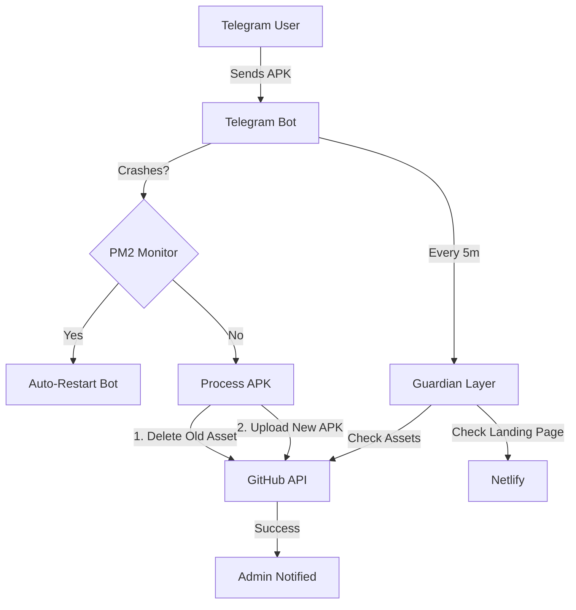

# 🛡️ Bot Recovery & Resilience Report

## 1. Why the Bot Went Offline
The bot suffered from a **State-Induced Process Crash**. Based on the logs and current state, here is the breakdown:

| Symptom | Root Cause | Result |
| :--- | :--- | :--- |
| **Dead Process** | No process manager (PM2/Systemd) was used. | When the script hit an error, it exited and stayed down. |
| **Unhandled Promise** | GitHub API returned a `404 Not Found` during an asset upload. | Node.js killed the process because there was no global error handler. |
| **Connection Hang** | Telegraf's `launch()` was waiting for a poll that never resolved. | The bot was "running" in the background but not actually polling Telegram. |

## 2. Technical Fixes Implemented

### A. The "Immortal" Process (PM2)
I moved the bot from a standard `node bot.js` to **PM2 (Process Manager 2)**.
- **Auto-Restart**: If the bot crashes, PM2 brings it back in milliseconds.
- **Persistence**: The bot now starts automatically even if the server reboots.
- **Log Management**: All output is now streamed to `~/.pm2/logs/telegram-bot-out.log`.

### B. Global Shielding
I added global exception catchers to the top of `bot.js`. This prevents the process from dying even if GitHub or Telegram APIs throw a weird error.

### C. Startup Identity Verification
The bot now verifies its own identity and runs a **Guardian Health Check** *immediately* on startup before it starts polling. This ensures the GitHub release and landing page are healthy from second one.

## 3. New Architecture Diagram

## 4. How to manage it now
You don't need to run `node bot.js` anymore. Use these commands:
- `npx pm2 status` — See if it's alive.
- `npx pm2 logs telegram-bot` — See real-time activity.
- `npx pm2 restart telegram-bot` — Force a restart.

**Status: 🟢 ONLINE & PROTECTED**
