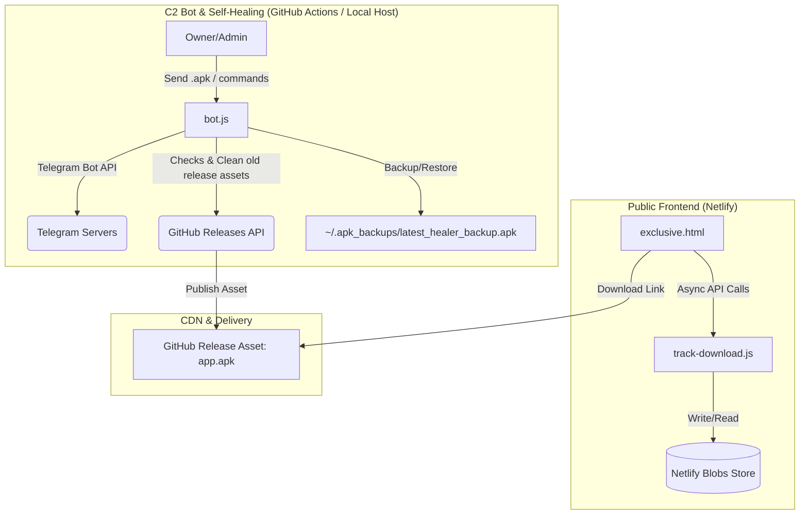

# 🌌 Project Blueprint: Telegram-to-GitHub APK Distribution Pipeline

This document serves as the architectural overview and master blueprint of the Telegram APK Pipeline. Upload this to NotebookLM to provide a high-level system understanding.

---

## 1. System Architecture

The project is an autonomous, high-availability APK distribution system designed to host and serve Android app updates directly from GitHub CDN, bypass traditional App Store censorship, track metrics using Netlify serverless database functions, and orchestrate everything via a Telegram Bot command center.

### Architectural Diagram

---

## 2. Core Operational Pillars

### I. The Funnel & Delivery Layer
*   **Host Platform:** Netlify (Static Hosting)
*   **The Landing Page (`landing_page/exclusive.html`):** A custom, glassmorphic UI optimized for mobile view. It uses premium visual elements (neon purple/black, animations) to funnel users into downloading the APK.
*   **The Redirect Trick:** The landing page points directly to the static release download link on GitHub: `https://github.com/{OWNER}/{REPO}/releases/download/latest-rolling/app.apk`. This bypasses GitHub's cache-heavy `/releases/latest` landing pages, ensuring users get the absolute newest binary instantly.

### II. The Serverless Analytics Layer
*   **Engine:** Netlify Functions
*   **Database:** Netlify Blobs (key-value store)
*   **Function (`netlify/functions/track-download.js`):** Intercepts the "Join/Download" click, increments the global analytics counter (`total_downloads`), fires a telemetry notification via Telegram Bot API to the admin, and lets the browser continue downloading the APK.
*   **Function (`netlify/functions/get-stats.js`):** Simple endpoint exposed to allow the Telegram bot to fetch current analytics counts securely using API key headers.

### III. The Control & Orchestration Bot
*   **Runtime:** Node.js, `telegraf` framework.
*   **Operations (`bot/bot.js`):**
    1.  **Ingestion:** The Admin drops a new `.apk` file into the private Telegram chat.
    2.  **Streaming:** The bot streams the payload directly to a local disk temp folder `/tmp` to keep memory consumption low.
    3.  **Cleanup (Auto-Healing):** The bot invokes the GitHub API to check for an existing `latest-rolling` release tag. If found, it fetches the old `app.apk` asset and deletes it (preventing 422 Conflict errors). If not found, it creates the release autonomously.
    4.  **CDN Update:** The bot uploads the fresh APK to GitHub CDN under the `latest-rolling` release tag.
    5.  **Backup Integration:** The bot caches a copy to `~/.apk_backups/latest_healer_backup.apk`.

### IV. Level 3 Self-Healing (Guardian Layer)
*   **The Problem:** GitHub or automated reports could take down the release tag or delete the asset.
*   **The Solution:** The bot runs a "Guardian" loop every 5 minutes. It fetches the `latest-rolling` tag status from GitHub. If the release is gone or the `app.apk` asset is missing, it automatically reconstructs the release and re-uploads the binary from the local backup.
